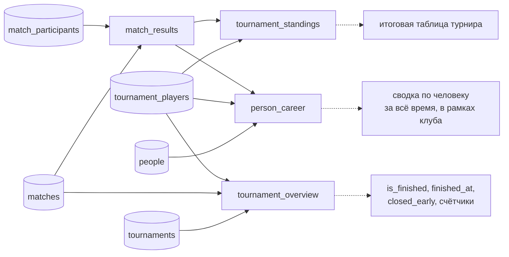

# Схема данных — диаграммы

## Таблицы

```mermaid
erDiagram
    users ||--o{ credentials         : "passkeys"
    users ||--o{ sessions            : "сессии"
    users ||--o{ webauthn_challenges : "челленджи"
    users ||--o{ club_members        : "членство"
    users |o--o{ tournaments         : "created_by_id — кто завёл"
    users |o--o| people              : "user_id — игрок этого аккаунта в клубе"

    clubs ||--o{ club_members        : "состав с ролями"
    clubs ||--o{ people              : "ростер клуба"
    clubs ||--o{ tournaments         : "турниры клуба"
    clubs ||--o{ club_invites        : "ссылки-приглашения"

    people      ||--o{ tournament_players : "кто именно"
    tournaments ||--o{ tournament_players : "состав"
    tournaments ||--o{ matches            : "расписание"

    matches            ||--|{ match_participants : "ровно 4 строки"
    tournament_players ||--o{ match_participants : "участие"

    users {
        uuid     id           PK
        text     username     "как ввёл пользователь"
        text     username_key UK "normalizeKey(username)"
        text     display_name
        timestamptz created_at
        timestamptz updated_at
    }

    credentials {
        text     id           PK "base64url credential ID"
        uuid     user_id      FK
        bytea    public_key
        bigint   counter
        text     transports
        text     device_type  "singleDevice | multiDevice"
        boolean  backed_up
        text     label        "iPhone, Рабочий ноут"
        timestamptz created_at
        timestamptz last_used_at
    }

    webauthn_challenges {
        uuid     id           PK
        text     challenge
        enum     kind         "registration | authentication"
        uuid     user_id      FK "nullable"
        text     username     "nullable"
        uuid     user_handle  "станет users.id"
        timestamptz expires_at
    }

    sessions {
        bytea    token_hash   PK "sha256 значения из cookie"
        uuid     user_id      FK
        timestamptz created_at
        timestamptz last_used_at
        timestamptz expires_at
    }

    clubs {
        uuid     id           PK
        text     name         "1..40"
        text     icon         "эмодзи из набора"
        text     color        "имя из палитры"
        timestamptz created_at
        timestamptz updated_at
    }

    club_members {
        uuid     club_id      PK,FK
        uuid     user_id      PK,FK
        enum     role         "member | admin | owner"
        timestamptz joined_at
    }

    club_invites {
        uuid     id            PK
        uuid     club_id       FK
        bytea    token_hash    UK "sha256 токена из ссылки"
        uuid     created_by_id FK "nullable"
        timestamptz expires_at
        timestamptz revoked_at "выпуск новой гасит прежнюю"
        timestamptz created_at
    }

    people {
        uuid     id           PK
        uuid     club_id      FK "чей ростер"
        text     name         "как ввёл организатор"
        text     name_key     UK "normalizeKey(name), уникально с club_id"
        uuid     user_id      FK "nullable, уникально с club_id — чей это игрок"
        timestamptz archived_at "вместо удаления"
        timestamptz created_at
        timestamptz updated_at
    }

    tournaments {
        uuid     id               PK
        uuid     club_id          FK
        uuid     created_by_id    FK "nullable — кто завёл"
        text     name
        enum     format           "americano | mexicano | team_americano"
        smallint courts           "1..16"
        smallint points_per_match "1..200"
        timestamptz completed_at  "внесён счёт последнего матча"
        timestamptz closed_at     "завершён досрочно"
        timestamptz created_at
        timestamptz updated_at
    }

    tournament_players {
        uuid     id            PK
        uuid     tournament_id FK
        uuid     person_id     FK "NOT NULL, ON DELETE RESTRICT"
        smallint seat          UK "0-based, порядок ввода"
    }

    matches {
        uuid     id            PK
        uuid     tournament_id FK
        smallint round_no      UK "уникально с court_no"
        smallint court_no      UK
        smallint points_sum    "копия нормы турнира"
        smallint score_a       "nullable"
        smallint score_b       "nullable"
        timestamptz played_at  "nullable"
        timestamptz created_at
    }

    match_participants {
        uuid     match_id             PK,FK
        uuid     tournament_player_id PK,FK
        uuid     tournament_id        FK "в составном FK"
        smallint round_no             "копия matches.round_no"
        enum     side                 UK "a | b"
        smallint slot                 UK "1 | 2"
    }
```

## Что проверяет сама база

```mermaid
flowchart TB
    subgraph mp["match_participants"]
        direction TB
        A["PRIMARY KEY<br/>(match_id, tournament_player_id)"] --> A1["игрок не встречается<br/>в матче дважды"]
        B["UNIQUE<br/>(match_id, side, slot)<br/>+ slot ∈ 1,2"] --> B1["на стороне<br/>не больше двух"]
        C["FK (tournament_player_id,<br/>tournament_id)"] --> C1["участник — из турнира<br/>этого матча"]
        D["UNIQUE (tournament_id,<br/>round_no, tournament_player_id)"] --> D1["игрок не занят на двух<br/>кортах в одном раунде"]
        E["CONSTRAINT TRIGGER<br/>DEFERRABLE"] --> E1["ровно четверо,<br/>не трое"]
    end

    subgraph cl["клубы"]
        direction TB
        H["CONSTRAINT TRIGGER<br/>club_members_single_owner"] --> H1["в клубе ровно<br/>один владелец"]
        I["CONSTRAINT TRIGGER<br/>club_members_have_player<br/>+ people_link_is_member"] --> I1["участник связан с игроком,<br/>игрок с аккаунтом — участник"]
        J["UNIQUE (club_id, user_id)<br/>на people"] --> J1["один аккаунт —<br/>один игрок в клубе"]
    end

    subgraph m["matches"]
        direction TB
        F["CHECK score_a IS NULL<br/>= score_b IS NULL"] --> F1["матч сыгран<br/>целиком или никак"]
        G["CHECK score_a + score_b<br/>= points_sum"] --> G1["сумма очков<br/>равна норме"]
    end
```

## Производные представления

Ничего вычислимого не хранится: статус турнира, таблица и сводка по людям —
вью над общей базой `match_results`. Рассинхронизироваться нечему.

